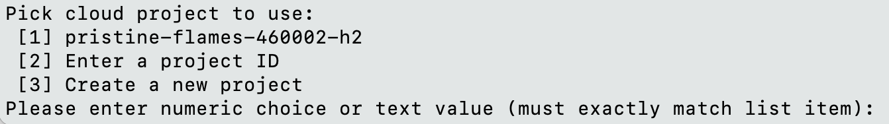
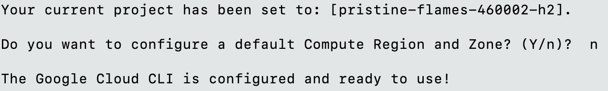

# FinlyWealth Product Search Engine

Contributors: Jenson Chang, Chukwunonso Ebele-Muolokwu, Da (Catherine) Meng, Jingyuan Wang

The goal of this project is to design and implement a fast, scalable multimodal search engine that captures the semantic meaning of user queries, allowing users to search using text, images, or both to find the most relevant products for [FinlyWealth](https://finlywealth.com/), an affiliate marketing platform expanding into e-commerce.

## Table of Contents

- [Prerequisites](#prerequisites)
- [Quick Start](#quick-start)
- [Data Structure Requirements](#data-structure-requirements)
  - [Required Data Format](#required-data-format)
  - [Optional Columns](#optional-columns)
  - [Data Organization](#data-organization)
  - [Data Quality Requirements](#data-quality-requirements)
  - [Processing Pipeline Steps](#processing-pipeline-steps)
  - [Environment Configuration](#environment-configuration)
  - [Troubleshooting Data Issues](#troubleshooting-data-issues)
- [Database Setup Instructions - Google Cloud SDK](#database-setup-instructions---google-cloud-sdk)
- [Database Setup Instructions - Docker Postgres](#database-setup-instructions---docker-postgres)
- [Application Setup Instructions - Makefile](#application-setup-instructions---makefile)
- [Application Setup Instructions - Docker](#application-setup-instructions---docker)
- [Setup Troubleshooting](#setup-troubleshooting)

## Quick Start

For the fastest setup using Docker (recommended for most users):

1. **Clone the repository:**

   ```bash
   git clone FinlyWealth/mds-finly-search
   cd mds-finly-search
   ```

2. **Create environment file:**

   ```bash
   # Create .env file with required configurations
   cat > .env << EOF
   # Database configuration for Google Cloud
   PGUSER=postgres
   PGPASSWORD=ZK3RjyBv6twoA9
   PGHOST=localhost
   PGPORT=5433
   PGDATABASE=postgres
   PGTABLE=products_1M
   
   # LLM API key (optional, for result reranking)
   OPENAI_API_KEY=<your-api-key>
   
   # Location of product images and FAISS indices
   GCS_BUCKET_URL=https://storage.googleapis.com/mds-finly
   EOF
   ```

3. **Build and run with Docker:**

   ```bash
   docker compose build
   docker compose up
   ```

4. **Access the application:**
   - Frontend: <http://localhost:8501>
   - Backend API: <http://localhost:5001>

For detailed setup instructions or alternative installation methods, see the sections below.

## Complete Setup Instructions

### Prerequisites

- [Docker](https://docs.docker.com/get-docker/)
- [Docker Compose](https://docs.docker.com/compose/install/) (if using docker-compose.yaml)
- [Google Cloud CLI](https://cloud.google.com/sdk/docs/install-sdk) (optional, for cloud database access)
- Git (optional, for cloning the repo)

### Setting up the database (choose one)

- [Instructions](#setup-instructions---google-cloud-sdk) for setting up Google SQL proxy to connect to the database hosted on Google Cloud.

- [Instructions](#setup-instructions---docker-postgres) for setting up a Postgres database in Docker. This method is recommended if you want to develop using your own embeddings locally. You will need to run preprocess scripts to generate indices and load data.

### Run the application (choose one)

- [Instructions](#setup-instructions---makefile) for running the search engine application through make file.
- [Instructions](#setup-instructions---docker) for running the search engine application through docker container. This method is recommended if you don't want to setup your local environment.

### Run experiment (optional)

- [Instructions](#using-makefile-to-run-mlflow-experiments) for running experiments.

### Deployment

- Deployments are done using Docker images. Follow [instructions](#setup-instructions---docker) to build and test Docker images locally.
- Use GitHub Actions to build and deploy images to Google Cloud.

## Data Structure Requirements

If you want to use this pipeline with your own dataset, your data must follow a specific structure to be compatible with the preprocessing and embedding generation steps.

### Required Data Format

Your dataset should be provided as a **CSV file** with the following required columns:

| Column Name | Data Type | Description | Example |
|-------------|-----------|-------------|---------|
| `Pid` | string/int | Unique product identifier | "12345" or 12345 |
| `Name` | string | Product name | "Apple iPhone 14 Pro" |
| `Description` | string | Detailed product description | "Latest smartphone with advanced camera..." |
| `Category` | string | Product category | "Electronics" |
| `Price` | float | Original product price | 999.99 |
| `PriceCurrency` | string | Currency code (USD, CAD, GBP) | "USD" |

### Optional Columns

The pipeline can handle additional columns that will be processed and included in the final dataset. You can modify the `src/preprocess/clean_data.py` to remove the columns not available in your dataset:

| Column Name | Data Type | Description |
|-------------|-----------|-------------|
| `FinalPrice` | float | Final price after discounts |
| `Discount` | float | Discount amount or percentage |
| `isOnSale` | boolean | Whether the product is on sale |
| `IsInStock` | boolean | Stock availability |
| `Brand` | string | Product brand |
| `Manufacturer` | string | Product manufacturer |
| `Color` | string | Product color |
| `Gender` | string | Target gender (if applicable) |
| `Size` | string | Product size |
| `Condition` | string | Product condition (new, used, etc.) |

### Data Organization

Your data should be organized in the following directory structure:

```
data/
├── csv/
│   └── data.csv          # Your raw CSV file goes here
├── clean/                # Processed data will be saved here
├── images/               # Product images (optional for image search)
│   ├── 12345.jpeg       # Images named by Pid
│   ├── 12346.jpeg
│   └── ...
└── embeddings/          # Generated embeddings will be saved here
```

### Data Quality Requirements

- **Required columns**: `Pid`, `Name`, `Description`, `Category`, `Price`, `PriceCurrency` must be present
- **Currency filtering**: Only USD, CAD, and GBP currencies are supported
- **Text fields** should contain meaningful, non-empty strings
- **Product IDs** (`Pid`) must be unique
- **Encoding**: CSV files should be UTF-8 encoded
- **Images** (if using multimodal search): JPEG format, named as `{Pid}.jpeg`

### Processing Pipeline Steps

Once your data is properly formatted and placed in the correct directories:

1. **Data Cleaning**:

   ```bash
   python src/preprocess/clean_data.py
   ```

   - Filters by supported currencies
   - Merges Brand and Manufacturer columns
   - Saves cleaned data to `data/clean/data.csv`

2. **Embedding Generation**:

   ```bash
   python src/preprocess/generate_embed.py
   ```

   - Generates CLIP embeddings for images (if available)
   - Generates MiniLM text embeddings from product names
   - Creates fusion embeddings combining both modalities
   - Saves embeddings to `data/embeddings/`

### Environment Configuration

You can customize data paths by setting environment variables in your `.env` file:

```bash
# Custom data paths (optional)
RAW_CSV_PATH=data/raw/my_products.csv
CLEAN_CSV_PATH=data/clean/my_clean_products.csv
EMBEDDINGS_PATH=data/my_embeddings
```

### Troubleshooting Data Issues

- **Missing required columns**: Ensure all mandatory columns are present with exact names (case-sensitive)
- **Currency issues**: Only USD, CAD, and GBP are supported in `PriceCurrency`
- **Empty values**: Remove rows with missing required information before processing
- **Image format**: Ensure product images are in JPEG format and named correctly (`{Pid}.jpeg`)
- **Large datasets**: The pipeline processes data in chunks of 500,000 rows for memory efficiency
- **Encoding issues**: Save your CSV with UTF-8 encoding to handle special characters

## Database Setup Instructions - Google Cloud SDK

### Step 1. Setup Google Cloud SDK

Install Google Cloud SDK for your platform from [here](https://cloud.google.com/sdk/docs/install-sdk)

For Mac, we suggest installing via Homebrew:

```bash
brew install google-cloud-sdk
```

Once installation is complete, sign in to your Google account. Ensure you've been granted access to the Google project from the repo admin.

### Step 2. Sign in to Google Cloud

```bash
gcloud init
```

Select your Google project (repo admin should provide you with the project ID)


When prompted to configure a default Compute Region and Zone, select `n`.


### Step 3. Add the Google Cloud SQL Credentials

Add the following by creating a `.env` text file in the root folder with the following configurations.

```bash
# Database configuration
PGUSER=postgres
PGPASSWORD=ZK3RjyBv6twoA9
PGHOST=localhost
PGPORT=5433
PGDATABASE=postgres
PGTABLE=products_1M
```

## Database Setup Instructions - Docker Postgres

### Step 1. Start the Docker container

```bash
docker compose -f docker-compose.db.yml up -d
```

### Step 2. Create Database Credentials

Add the following to the `.env` file

```bash
# Database configuration
PGUSER=finly-admin
PG_SUPERUSER=postgres # this need to match the environment POSTGRES_USER in the docker-compose.db.yml file
PGPASSWORD=postgres # this need to match the environment POSTGRES_PASSWORD in the docker-compose.db.yml file
PGHOST=localhost
PGPORT=5432
PGDATABASE=finly
PGTABLE=products
```

### Step 3. Setup Database

This will create the database using information from Step 2. It will also add the pgvector extension to the database.

```bash
make db-setup
```

### Step 4. Load Data

Please refer to the [Preprocessing Instructions](src/preprocess/README.md) on how to load the database with product data. You must do this before run the application.

## Application Setup Instructions - Makefile

### Step 1. Setup Python environment

Set up Python environment:

```{bash}
# Create a new Python environment
conda env create --f environment.yaml
```

### Step 2. Configure Environment Variables

Add the following to the `.env` file.

```bash
# LLM API key
OPENAI_API_KEY=<insert-api-key>

# Location of product images and FAISS indices on Google Cloud Storage
GCS_BUCKET_URL=https://storage.googleapis.com/mds-finly
```

### Step 3. Start Application

To start the app and the server:

```{bash}
# Starts streamlit frontend and API backend
make run
```

## Application Setup Instructions - Docker

### Step 1. Clone the Repository

In a separate terminal, clone the repository.

```bash
git clone FinlyWealth/mds-finly-search
cd mds-finly-search
```

### Step 2. Configure Environment Variables

Add the following to the `.env` file.

```bash
# LLM API key
OPENAI_API_KEY=<insert-api-key>

# Location of product images and FAISS indices on Google Cloud Storage
GCS_BUCKET_URL=https://storage.googleapis.com/mds-finly
```

### Step 3. Build Docker Containers

Start Docker and create the Docker images for both frontend and backend services.

```bash
docker compose build
```

This step may take several minutes as it downloads and builds all required dependencies.

### Step 4. Start the Application

Make sure the proxy is running and launch the application.

```bash
docker compose up
```

The application will start two services:

- Frontend: Access the search interface at <http://localhost:8501>
- Backend API: Running at <http://localhost:5001>

### Step 5. Clean Up

To close the container and free up the port once the proxy is not needed

```bash
docker compose down
make clean
```

## Setup Troubleshooting

### To test the api through command line

```{bash}
# test text search
curl -X POST http://127.0.0.1:5001/api/search/text -H "Content-Type: application/json" -d '{"query": "red pant"}'

# test image search
# download any product image and stored as test-img.jpeg
curl -X POST http://127.0.0.1:5001/api/search/image -H "Content-Type: application/json" -d '{"image_path": "{absolute-path-to-repo}/mds-finly-search/test-img.jpeg"}'
```