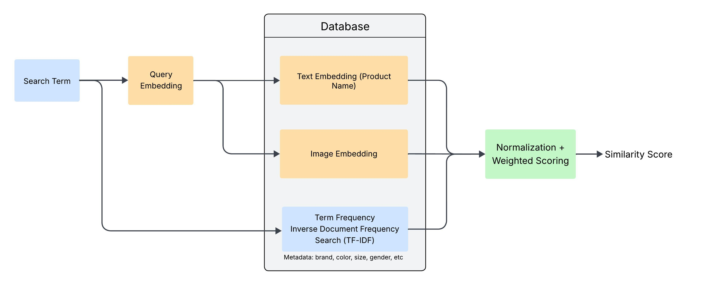

# mds-finly-search

## Setup Instructions
1. Download the sample embeddings and images from: https://drive.google.com/file/d/1NW-ZzWFXdKlNZPJ64fkmVotWvr1zQmQx/view?usp=share_link
2. Extract the zip file in the `data` folder
3. Set up Python environment using `environment.yaml`
4. Install [postgresql](https://www.postgresql.org) and [pgvector](https://github.com/pgvector/pgvector) extension
5. Create envrionment `.env` file
    ```
    PGUSER=finly-admin
    PGPASSWORD=123
    PGHOST=localhost
    PGPORT=5432
    PGDATABASE=finly
    ```
6. `python src/util/load_db.py` to load the database with the embeddings and metadata
7. `python app.py` to run the app

## Search workflow


### Embeddings
- Embeddings are generated using `openai/clip-vit-base-patch32` model. The text and image embeddings have a shared embedding space. 
- Uses the database to calculate cosine distance between embeddings for faster speed

### Metadata
- Currently searches of the metadata using Term Frequency-Inverse Document Freqeuncy search provided by the database
- When the database is loaded, metadata columns are preprocessed and turned into tsvectors.
- Preprocessing: Words are stemmed and its position/frequency are recorded. An example of what a tsvector looks like:
    ```
    'accessori':21 'apparel':20 'blue':30 'cloth':22 'fifth':25,27 'licens':13 'light':29 'littl':15 'male':31 'offici':12 'poni':16 'ride':9 'saddl':1 'shirt':19,23 'sun':26,28 't-shirt':17 'take':7 'time':5 'top':24
    ```
- Could probably be improved significantly by using NLP instead of TF-IDF
