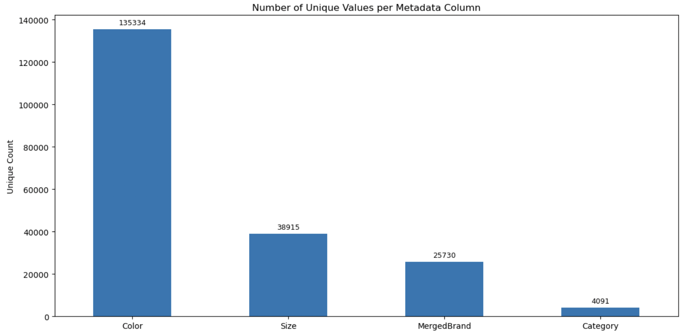
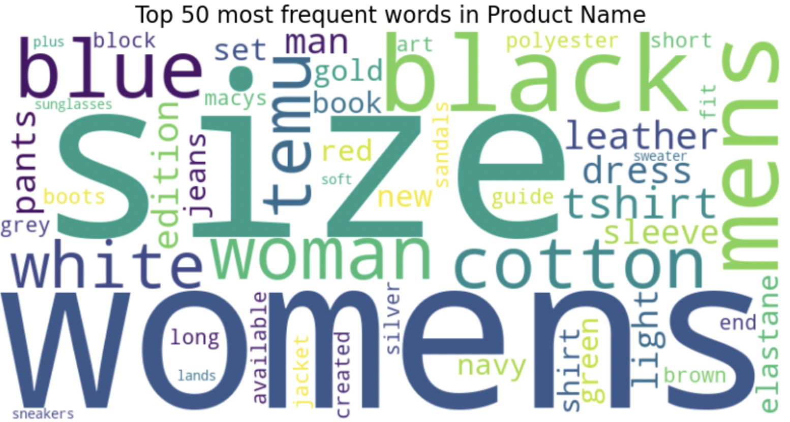
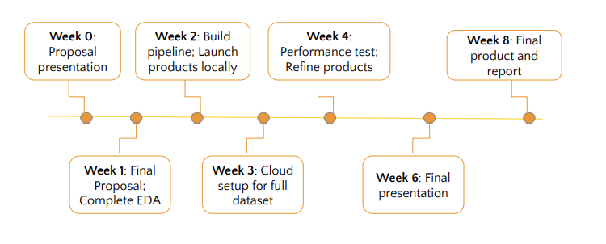

# Find me a better product!
Jenson Chang, Chukwunonso Ebele-Muolokwu, Catherine Meng, Jingyuan Wang

-   [Executive Summary](#executive-summary)
-   [Introduction](#introduction)
-   [Data Science Techniques](#data-science-techniques)
-   [Timeline](#timeline)
-   [References](#references)

## Executive Summary

FinlyWealth, an affiliate marketing platform offering cashback on
financial products, is expanding into e-commerce with a broader product
catalog. To support this transition, a team of Master of Data Science
students from the University of British Columbia is developing a fast,
scalable product search engine with multimodal semantic capabilities.
The system will support both text and image-based queries using a hybrid
retrieval strategy that combines lexical (TF-IDF) and semantic (CLIP)
models, indexed via FAISS for efficient large-scale search. The dataset
includes over 15 million product images and metadata entries. Given the
dataset’s size and complexity, the project involves rigorous data
preprocessing, vector storage optimization, and performance tuning. A
user-friendly frontend, backend API, and similarity engine will form the
core architecture. Success will be evaluated through recall@K, latency,
and human feedback. The final deliverable will be a working prototype
demonstrating robust, intelligent product retrieval at e-commerce scale.

## Introduction

FinlyWealth is an affiliate marketing platform that offers cashback
rewards for product purchases. While their current offerings focus on
personal finance products, they aim to expand into the e-commerce space
with a broader product portfolio. To support this initiative, a team of
Master of Data Science students from the University of British Columbia
is collaborating with FinlyWealth to develop an intelligent product
search engine powered by machine learning.

### Problem Statement

The current search system supports only basic keyword-based text queries
and lacks semantic understanding (e.g., pants under $100) or support for
multimodal inputs (e.g., images). Additionally, the system’s scalability
and performance have not been evaluated for large-scale product
catalogs, which are expected to grow from hundreds to millions of items.

### Objective

The goal of this project is to design and implement a fast, scalable
product search engine with multimodal semantic capabilities, supporting
both text and image-based queries. The system will comprise four core
components: a user-facing frontend, a set of backend API endpoints, a
similarity computation module and a vector-aware database for efficient
retrieval. The project will be developed over an 8-week timeline in
close collaboration with FinlyWealth. Success will be evaluated using
quantitative and qualitative metrics, including query latency, Recall@K
for relevance, and human feedback on recommendation quality. The final
deliverable will be a functional prototype that demonstrates the
potential for large-scale deployment.

## Data Science Techniques

#### Data Source and Description

The dataset comprises two primary sources: product images and metadata.
The image folder contains approximately 15 million, 100x100 pixel JPEG
images. It is assumed each product will have a single corresponding
image. The metadata file contains 30 columns covering product attributes
such as product id, name, description, color, brand and price.
FinlyWealth has obtained the dataset from their affiliate network.

**Missing Values**

Certain columns have missing values in more than 90% of the data, such
as “ShortDescription” and “Keywords”. These are unlikely to be used for
our data pipeline. Other fields such as “Gender”, “Color”, and “Brand”
also have a significant proportion of missing values. These are expected
since these attributes do not apply to some products such as books.

**High Cardinality**

Columns such as “Category”, “Color”, “Size”, and “Brand” have high
cardinality as shown in
<a href="#fig-uniquecounts" class="quarto-xref">Figure 1</a>. In
addition, columns “Brand” and “Manufacturer” have a 82% overlap in their
unique values so the two columns have been merged into “MergedBrand” to
eliminate duplication.

**Overlap Between Product Name and Metadata**

To better understand what users are likely to search for, we analyzed
the top 50 most frequent words in product names as shown in
<a href="#fig-topwords" class="quarto-xref">Figure 2</a>. Common terms
like “womens”, “mens”, “size”, and “black” appear frequently and often
overlap with metadata fields such as gender and color.

### Proposed Approach & Methodology

We are developing a multimodal, retrieval-augmented product search
system that integrates advanced natural language processing techniques.
This system will combine OpenAI CLIP(Li et al. 2021) (Contrastive
Language-Image Pre-training), TF-IDF(Aizawa 2003) (Term
Frequency–Inverse Document Frequency), and FAISS(Johnson, Douze, and
Jégou 2017) (Facebook AI Similarity Search) to create joint image-text
embeddings, enabling seamless cross-modal search.

At the core of the system, both textual and visual representations of
product data are embedded and stored in a searchable database. When a
user submits a query—whether as text, image, or both—the system
generates a corresponding embedding and compares it to stored
representations. The most similar matches are identified and the top k
results (where k is the number of desired outputs) are retrieved and
presented to the user.

<figure>

<figcaption aria-hidden="true">Workflow Diagram</figcaption>
</figure>

#### Models and Algorithms

To support multimodal product search, we use a combination of lexical
and semantic retrieval methods:

-   **OpenAI CLIP** embeds both images and text into a shared vector
    space, enabling cross-modal search based on semantic similarity.
-   **TF-IDF** provides fast, interpretable keyword-based retrieval,
    useful for exact matches in structured product data.
-   **FAISS** enables efficient approximate nearest neighbor search over
    CLIP embeddings, allowing us to scale to millions of products.

#### Hybrid Retrieval Strategy

We combine results from CLIP and TF-IDF using a weighted scoring system:

-   Each model returns a relevance score for a user query.
-   Scores are weighted (e.g., 70% CLIP, 30% TF-IDF) and merged.
-   The final ranked list balances semantic relevance with textual
    precision.

This hybrid approach improves retrieval accuracy across varied query
types and product data quality.

#### Data Preprocessing and Feature Engineering Plans

To prepare over 15 million product listings for multimodal retrieval, we
apply thorough data preprocessing and feature engineering to ensure
clean, semantically rich inputs. For text data, we normalize high
cardinality columns (e.g., brand, category) through case folding,
frequency filtering, and removing multilingual entries based on client
requirements. To create robust embeddings, we combine key fields like
title, brand, and description into a unified text template.

#### Baseline Approach: TF-IDF

As a baseline for evaluating the effectiveness of our multimodal
retrieval system, we will implement a TF-IDF based retrieval model.
TF-IDF is a well-established, interpretable, and lightweight method that
ranks documents by the importance of query terms, making it particularly
effective in structured domains like e-commerce, where product listings
often contain specific terms such as brand names, sizes, colors, and
categories.

While TF-IDF does not capture semantic meaning like deep learning models
such as CLIP, it remains highly effective for exact keyword matching and
serves as a strong, interpretable baseline for assessing retrieval
performance.

#### Modeling Pipeline and Architecture

The modeling pipeline starts with preprocessing raw product data—such as
names, brands, and categories—by cleaning, normalizing, and combining
relevant fields into a structured text format. Images are resized to
match CLIP’s input requirements. We then extract features using two
approaches: TF-IDF for sparse, interpretable text representations, and
CLIP for dense multimodal embeddings that align text and images in a
shared semantic space. These features are indexed using inverted
indexing (for TF-IDF) and FAISS (for CLIP) to support fast, scalable
retrieval. At query time, user input is encoded by both models, and
results are retrieved from their respective indexes. A weighted scoring
system merges these results, balancing lexical precision from TF-IDF
with semantic relevance from CLIP, to produce a robust and accurate set
of top-ranked results.

    User Query
       │
       ├──► TF-IDF Tokenizer ─────────────┐
       │                                  │
       ├──► CLIP Encoder ───────┐         │
       │                        │         ▼
       ▼                        ▼     TF-IDF Index (Sparse)
    CLIP Embedding        TF-IDF Vector         │
       │                        │               ▼
       ▼                        └─────► Retrieve Matches
    FAISS Index (Dense)                     ▲
       │                                    │
       └───────────────► Merge & Weight Results ◄──────┐
                                           │          │
                                           ▼          │
                                     Top-K Ranked Results

#### Tools and Libraries

A variety of tools and libraries are used in this project to support
data processing, model serving, image handling, and vector search. These
tools include Numpy(Harris et al. 2020), Flask(Ronacher 2010),
Pillow(Clark and Contributors 2010), Spacy(Honnibal and Montani 2017),
Huggingface(Wolf et al. 2020) etc. The table below outlines each tool
and its role within the system.

<table>
<colgroup>
<col style="width: 14%" />
<col style="width: 85%" />
</colgroup>
<thead>
<tr class="header">
<th>Library</th>
<th>Purpose in Project</th>
</tr>
</thead>
<tbody>
<tr class="odd">
<td>NumPy</td>
<td>Efficient numerical operations, especially for vector manipulation
and math ops.</td>
</tr>
<tr class="even">
<td>Flask</td>
<td>Lightweight web framework used for rapid prototyping of API
endpoints.</td>
</tr>
<tr class="odd">
<td>FAISS</td>
<td>Approximate nearest neighbor search for CLIP embeddings; enables
fast vector search.</td>
</tr>
<tr class="even">
<td>Hugging Face</td>
<td>Access to pretrained models like CLIP; used for text and image
embedding.</td>
</tr>
<tr class="odd">
<td>Pillow</td>
<td>Image processing library used for resizing, normalization, and
format conversion.</td>
</tr>
<tr class="even">
<td>spaCy</td>
<td>Natural language processing toolkit for tokenization, NER, and text
normalization.</td>
</tr>
<tr class="odd">
<td>Pinecone</td>
<td>Scalable, cloud-based vector database for fast and persistent
similarity search.</td>
</tr>
<tr class="even">
<td>PostgreSQL</td>
<td>Relational database to store Embeddings. Allows for multiple columns
to have ebeddings</td>
</tr>
</tbody>
</table>

## Timeline

Given the large size of the dataset, we anticipate that refinements and
optimization will require substantial time; therefore, we plan to begin
as early as possible. In Week 1, we will develop the initial pipeline,
finalize the project proposal, and complete the necessary exploratory
data analysis (EDA).

Week 2 will focus on developing the core components locally, including
the user interface, API, and pipeline integration. In Week 3, we will
process the full dataset on the cloud and integrate all components,
while also exploring the impact of advanced NLP techniques.

In Week 4, we will initiate performance testing and begin iterative
refinements. By Week 6 (before June 9), we aim to deliver a runnable
draft to our mentor, with the final presentation scheduled for June 12
or 13. The final product and report will be completed by June 26 (Week
8).

We acknowledge the complexity of this project and plan to experiment
with a range of techniques. Apart from hard submission deadlines, the
timeline will remain flexible to accommodate progress.

<figure>

<figcaption aria-hidden="true">timeline</figcaption>
</figure>

## References

Aizawa, Akiko. 2003. “An Information-Theoretic Perspective of Tf–Idf
Measures.” *Information Processing & Management* 39 (1): 45–65.

Clark, Alex, and Contributors. 2010. “Pillow (PIL Fork).”
<https://python-pillow.org/>.

Harris, Charles R, K Jarrod Millman, Stéfan J van der Walt, Ralf
Gommers, Pauli Virtanen, David Cournapeau, Eric Wieser, et al. 2020.
“Array Programming with NumPy.” *Nature* 585 (7825): 357–62.

Honnibal, Matthew, and Ines Montani. 2017. “spaCy 2: Natural Language
Understanding with Bloom Embeddings, Convolutional Neural Networks and
Incremental Parsing.” <https://spacy.io/>.

Johnson, Jeff, Matthijs Douze, and Hervé Jégou. 2017. “FAISS: A Library
for Efficient Similarity Search and Clustering of Dense Vectors.”
<https://github.com/facebookresearch/faiss>.

Li, Yangguang, Feng Liang, Lichen Zhao, Yufeng Cui, Wanli Ouyang, Jing
Shao, Fengwei Yu, and Junjie Yan. 2021. “Supervision Exists Everywhere:
A Data Efficient Contrastive Language-Image Pre-Training Paradigm.”
*arXiv Preprint arXiv:2110.05208*.

Ronacher, Armin. 2010. “Flask: Web Development, One Drop at a Time.”
<https://flask.palletsprojects.com/>.

Wolf, Thomas, Lysandre Debut, Victor Sanh, Julien Chaumond, Clement
Delangue, Anthony Moi, Pierric Cistac, et al. 2020. “Transformers:
State-of-the-Art Natural Language Processing.”
<https://huggingface.co/transformers>.
